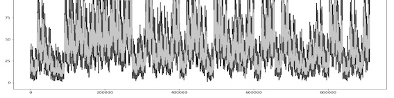
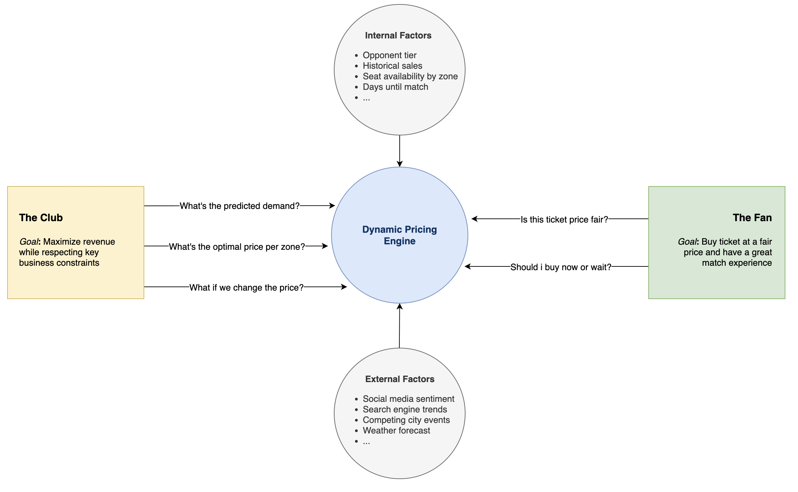
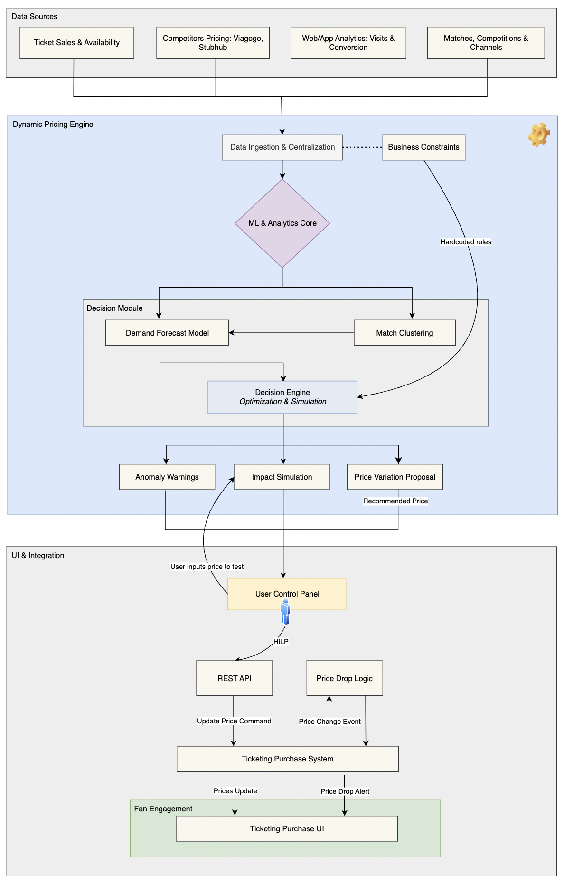

# 🏟️ SmartBooking Seats Engine

<p align="left">
  
</p>

> A predictive analytics system that forecasts seat availability for football matches. **Objective:** To solve the massive supply-demand imbalance in ticket sales by using machine learning to predict seat availability, maximizing matchday revenue and improving the fan experience at the stadium.

### Outline

- [Key Results](#key-results)
- [Overview](#overview)
- [Architecture](#architecture)
- [Dataset](#dataset)
- [Modeling](#modeling)
- [Structure](#structure)

---

## Key Results

| Metric                      | Result                               | Description |
| :-------------------------- | :----------------------------------- | :----------------------------------- |
| 📈 Revenue Growth           | **+15%** in Ticket Sales    | Enabled by confidently selling tickets predicted to become available, capturing previously lost demand. |
| 💰 Average Order Value | **+40%** Increase | A direct result of guaranteeing paired seating for families and groups, which encourages larger transactions. |
| 🎯 Forecast Accuracy | **89%** Accuracy (R²) | The model's predictions of final seat availability were highly accurate, providing a reliable basis for advance sales. |
| ⭐ Fan Experience          | **Paired Seating Guaranteed**  | Transformed the fan purchase journey from a lottery to a reliable process, drastically reducing empty single seats and improving atmosphere. |
| 📢 Marketing Efficiency | **Improved ROAS** | A wider time window to market the match allows for more effective campaign planning and better Return on Ad Spend (ROAS). |
| ⚖️ Pricing Flexibility | **Enabled Dynamic Pricing** | An extended sales timeframe creates opportunities to apply dynamic pricing strategies, optimizing revenue further. See **FCB_Dynamic-Pricing** </br> [](https://github.com/tomas-ravalli/fcb-dynamic-pricing) |
| 🛡️ Fraud Reduction | **Mitigated Scalping** | By delaying the issuance of physical tickets until 48 hours before kick-off, the system combats fraud and unauthorized resale. |

## Overview

The SmartBooking engine acts as a forecasting layer. It ingests historical sales data and contextual factors to predict, weeks in advance, how many seats will ultimately be freed up in each stadium zone. This forecast empowers the club to sell a calculated number of tickets *before* they are officially released, bridging the gap between fan demand and latent supply. This moves the club from a reactive sales model to a proactive, predictive one.

| 🚩 The Problem | 💡 The Solution |
| :--------------------------- | :---------------------------- |
| **"Sold Out" Illusion**: Fans faced "Sold Out" messages, unaware that 40% of released seats appear in the last 72 hours. | **Advance Availability**: Predicts final seat count weeks in advance, allowing the club to sell tickets for seats that are not yet officially released. |
| **Lost Revenue**: High demand went unmet due to the delay in seat returns, leading to significant lost revenue for the club. | **Revenue Capture**: Unlocks millions in sales by matching early fan demand with predicted inventory. |
| **Poor Fan Experience**: The unpredictable nature of ticket availability frustrated fans and fueled secondary resale markets. | **Guaranteed Experience**: Offers fans, especially families and groups, guaranteed paired seating, improving satisfaction and trust. |
| **Seat Fragmentation**: Last-minute releases often resulted in many isolated single seats that were difficult to sell. | **Optimized Occupancy**: By selling seats early, the system facilitates better seat allocation, reducing empty singles and maximizing attendance. |

The diagram below illustrates the conceptual framework for the SmartBooking project. The system addresses the core problem of information asymmetry in ticket availability. Season ticket holders often release their seats back to the club very late, creating a frustrating experience for fans who see matches as "Sold Out" when thousands of seats will eventually become available.

<p align="center">
  
  <br>
  <em>Fig. 1: A high-level diagram of the Dynamic Pricing Engine.</em>
</p>


## Architecture

The general workflow is as follows:
1. **Data Sources** are collected and fed into the central engine.
2. The **Dynamic Pricing Engine** uses machine learning models and business rules to generate a price recommendation.
3. The pricing team uses the **UI & Integration** layer to review, simulate, and approve the price, which is then updated in the live ticketing system.

<p align="center">
  
    <br>
  <em>Fig. 2: A low-level diagram of the Dynamic Pricing Engine.</em>
</p>

<details>
<summary><b>Click to see the detailed architecture breakdown</b></summary>

### 1. Data Sources

| Component | Description |
| :--- | :--- |
| **Ticket Sales & Availability** | Historical and real-time data on ticket inventory, sales velocity, and transactions per seating zone. |
| **Competitors Pricing** | Scraped pricing data from secondary markets (e.g., Viagogo, Stubhub, etc.) for competitive analysis. |
| **Web/App Analytics** | Data on user behavior from the official website and app, including page visits, clicks, and conversion funnels. |
| **Matches, Competitions & Channels** | Foundational information about each match, including opponent, date, competition type, and sales channel. |

### 2. Dynamic Pricing Engine

| Component | Description |
| :--- | :--- |
| **Data Ingestion & Centralization** | The entry point that gathers data from all sources and consolidates it into a unified data store for processing. |
| **ML & Analytics Core** | The central "brain" where data is processed, features are engineered, and the machine learning models are trained and executed. |
| **Business Constraints** | A module that receives strategic inputs from the club (e.g., price floors/caps) and applies these rules to the optimization process, ensuring recommendations are compliant with business strategy. |
| **Decision Module** | A container for the core predictive models that feed the optimization engine. |
| ┣ **Demand Forecast Model** | A model that predicts the expected volume of ticket sales at various price points, using historical data and match context to inform its forecast. |
| ┣ **Match Clustering** | An algorithm that groups similar past matches to provide a contextual baseline for the *Demand Forecast Model*. |
| **Decision Engine: Optimization & Simulation** | Takes the predicted demand curve and business rules to find the revenue-maximizing price. It also runs simulations for "what-if" scenarios. |
| **Anomaly Warnings** | An alerting system that flags unusual sales patterns or pricing recommendations that deviate from norms. |
| **Impact Simulation** | A feature that allows a human user to test a hypothetical price and see a projection of its impact on sales and revenue. |
| **Price Variation Proposal** | The final output of the engine: a concrete price recommendation for a given seat or section. |

### 3. UI & Integration

| Component | Description |
| :--- | :--- |
| **User Control Panel** | The dashboard used by the pricing team to view price proposals, run impact simulations, and approve or reject changes, enabling Human-in-the-Loop (HITL) control. |
| **REST API** | The communication layer that allows the User Control Panel to send approved price change commands to the live ticketing system. |
| **Price Drop Logic** | An automated module that can trigger price change events based on predefined rules, such as slow ticket sales. |
| **Ticketing Purchase System** | The club's main backend system that processes transactions and manages ticket inventory. It receives price update commands from the API. |
| **Fan Engagement** | The final layer where fans interact with the system's output. |
| ┗ **Ticketing Purchase UI** | The public-facing website or application screen where fans see the dynamically adjusted prices and make their purchases. |

</details>


## Dataset

To showcase the model's capabilities without exposing confidential information, this repository uses a synthetically generated dataset. This dataset is not just random data; it is carefully engineered to mirror the complexity, scale, and statistical properties of a real-world ticketing environment for a top-tier football club.

This version of the dataset emphasizes **time-series depth over breadth**. It simulates:

* **A focused set of matches:** It contains data for **10 unique matches**, representing a diverse sample of fixtures including league, cup, and international games.
* **Complete sales history:** For each of these matches, a full **90-day time-series** is generated. This means there is a daily record capturing how demand signals, sales, and availability evolve from the day tickets go on sale until match day.
* **Zone-level granularity:** Each daily record is further broken down by **5 distinct seating zones**, each with its own capacity and base price, reflecting how different stadium areas have unique demand curves.

This deep, time-series structure is ideal for building sophisticated forecasting models that can learn the complex dynamics of demand over time.

A key part of the modeling strategy was to move beyond our internal sales history by enriching our models with external data. Through feature engineering, we combined our own historical performance data with real-world market signals—like opponent rankings and social media hype—to create a more holistic and predictive view of market dynamics. The model's accuracy is dependent on a feature set combining **internal and external** data.

<details>
<summary><b>Click to see the full list of features</b></summary>

-   `competing_city_events` (*Boolean*): `True` if there are other major events (concerts, festivals, summits) in the city on the same day.
-   `competitor_avg_price` (*Float*): The average ticket price for a comparable entertainment event (e.g., mobile world congress, a concert) on the same day. Represents the competitive landscape.
-   `days_until_match` (*Integer*): The number of days remaining before the match. A key feature for time-series analysis, as demand typically increases as the match date approaches.
-   `ea_opponent_strength` (*Integer*): A rating of the opponent's strength based on the EA Sports FC game, determined by player ratings and team tactics.
-   `flights_to_barcelona_index` (*Integer*): A synthetic index (scaled 20-100) representing the volume of inbound flights to the city. This serves as a proxy for tourist demand.
-   `google_trends_index` (*Integer*): A synthetic index (scaled 20-100) representing public search interest for the match on Google. A proxy for general public interest and hype.
-   `holidays` (*Boolean*): `True` if the match day falls on or near a local or national holiday.
-   `internal_search_trends` (*Integer*): A synthetic count of searches for match tickets on the club's own website or app. A direct signal of purchase intent from the user base.
-   `league_winner_known` (*Boolean*): `True` if the winner of the league has already been decided before the match.
-   `match_id` (*Integer*): A unique identifier for each football match.
-   `opponent_tier` (*String*): A categorical rating of the opponent's quality and appeal (`A++`, `A`, `B`, `C`). Higher tiers signify more attractive matches.
-   `seat_zone` (*String*): The name of the seating zone in the stadium (e.g., 'Gol Nord', 'Lateral', 'VIP').
-   `social_media_sentiment` (*Float*): A synthetic score representing the overall public sentiment (e.g., from -1.0 for strong negative to +1.0 for strong positive) about the match on social media platforms.
-   `team_position` (*Integer*): The team's current position in the league table at the time of the match.
-   `ticket_availability_pct` (*Float*): The percentage of total seats in the zone that are still available.
-   `ticket_price` (*Float*): The price of the ticket. This is a *key input* feature for the demand model and the *final output* of the optimization engine.
-   `top_player_injured` (*Boolean*): `True` if a key player is injured and not expected to play in the match.
-   `weather_forecast` (*String*): The predicted weather for the match day ('Sunny', 'Windy', 'Rain').
-   `web_conversion_rate` (*Float*): The synthetic conversion rate on the website (ticket purchases / visits). A measure of how effectively web traffic is converting into sales.
-   `web_visits` (*Integer*): A synthetic count of visits to the ticketing section of the club's official website. A measure of online traffic and interest.
-   `weekday_match` (*Boolean*): `True` if the match is played on a weekday (Monday-Friday).
-   **`zone_historical_sales`** (*Integer*): **(Target Variable)** The historical number of tickets sold for a similar match in that zone. This is the *primary target variable* for the demand forecast model.
-   `zone_seats_availability` (*Integer*): The absolute number of seats still available for purchase in that zone.

</details>

### Match Excitement Factor

To create a realistic dataset, the generation script doesn't just create random numbers. Instead, it simulates the underlying market dynamics by creating a unified **"Match Excitement Factor"**. This single, powerful variable acts as the primary driver for most of the demand signals in the dataset.

The logic is designed to mimic how a real fan's interest level would change based on the context of a match:

1.  **Start with the opponent:** The excitement level begins with the quality of the opponent (`opponent_tier`). A top-tier opponent naturally generates more interest.

2.  **Adjust for context:** The base excitement is then adjusted up or down based on several real-world factors:
    * **League position:** Excitement increases slightly if the team is high in the league standings.
    * **Player injuries:** Excitement decreases significantly if a star player is injured, especially for a high-profile match.
    * **Match importance:** Excitement drops for less meaningful matches, such as when the league winner is already known.
    * **Holidays & weekdays:** Matches near holidays get a boost in excitement, while weekday matches see a slight decrease.

3.  **Drive demand signals:** This final "Match Excitement Factor" is then used to generate all the other demand signals. For example, a match with a high excitement score will also have higher `google_trends_index`, more positive `social_media_sentiment`, and more `internal_search_trends`.

This systemic approach ensures that the relationships between the features in the synthetic dataset are correlated in a logical and realistic way, making it a robust foundation for building and testing a demand forecasting model.

## Modeling

The modeling strategy followed a two-stage process: first *predict*, then *optimize*. This phase included the following tasks:
- Select and train a model using the prepared dataset.
- Conduct error analysis to identify improvement areas.
- Iterate on model architecture, hyper-parameters, or data as needed.
  
The system first forecasts demand with high accuracy and then uses that forecast within a *Decision Engine* to find the optimal price.

### Stage 1: 📈 Demand Forecasting

This stage answers the question: *"At a given price, how many tickets are we likely to sell?"*

| Aspect | Description |
| :--- | :--- |
| **Model** | An `XGBoost` regressor forecasts ticket demand (`zone_historical_sales`) by seating zone for each match. |
| **Rationale** | XGBoost was chosen for its exceptional performance, speed, and ability to handle the complex, non-linear relationships discovered during EDA. Its regularization features also help prevent overfitting, making it a robust choice. |
| **Features** | The model uses a rich set of internal and external factors, including historical sales, opponent tier, social media sentiment, and other engineered features. |
| **Application** | This trained model powers the *Impact Simulation* feature, allowing the commercial team to perform "what-if" analysis by inputting a hypothetical price and instantly seeing the likely impact on revenue and sales. |
| **Design Choice** | XGBoost is an industry standard for structured data problems, known for its performance and optimization. It was selected for its proven effectiveness in similar real-world forecasting tasks. |

<details>
<summary><b>Click to see the detailed model performance evaluation</b></summary>

To ensure the final pricing decision is effective, the underlying demand forecast must be highly accurate. Therefore, the primary goal of this evaluation was to minimize prediction error. Performance was evaluated against a **baseline model** (`DummyRegressor`) to ensure the model was genuinely learning. The key metric chosen was **WAPE**, as it provides a clear, interpretable measure of percentage error that resonates with business stakeholders.

| Metric                        | Value           | Description & Rationale                                                                                                                                                                                              |
| :---------------------------- | :-------------- | :----------------------------------------------------------------------------------------------------------------------------------------------------------------------------------------------------------------- |
| **WAPE** (Primary Metric) | **14%** | **Why we chose it:** Weighted Absolute Percentage Error is the most critical metric for this business case. It tells us the average forecast error in percentage terms, making it highly interpretable for revenue planning. A low WAPE is our main goal. |
| **R² Score** | **0.86** | **For model fit:** This shows that the model explains 86% of the variance in ticket sales, confirming it has a strong statistical fit to the data and learns the underlying patterns effectively.                                |
| **Mean Absolute Error (MAE)** | **~254 tickets**| **For business context:** MAE tells us that, on average, our forecast is off by about 254 tickets. This gives stakeholders a concrete sense of the error margin in absolute units.                                      |
| **Root Mean Squared Error (RMSE)**| **~312 tickets**| **For robustness:** RMSE penalizes larger errors more heavily. A higher RMSE relative to MAE suggests the model occasionally makes larger prediction errors, which is useful information for risk assessment.             |

The performance was considered *successful*. A WAPE of 14% and an R² of 0.86 demonstrated a robust and reliable forecasting engine.

</details>

### Stage 2: ⚙️ Price Optimization

This stage answers the business question: *"What is the single best price to maximize total revenue?"*

| Aspect         | Description                                                                                                                                                                                          |
| :------------- | :--------------------------------------------------------------------------------------------------------------------------------------------------------------------------------------------------- |
| **Model** | A custom *Optimization Engine* performs an exhaustive grid search over a range of valid prices.                                                                                                        |
| **Rationale** | A grid search is a reliable and straightforward method to find the optimal price within defined business constraints (e.g., price caps and floors). It guarantees finding the maximum projected revenue. |
| **Process** | The engine iterates through potential prices (e.g., from €75 to €350), uses the demand model to predict sales for each, calculates the projected revenue `(Price × Predicted Sales)`, and returns the optimal price. |
| **Output** | The engine's primary output is the official `Price Variation Proposal`, which is sent to the commercial team for review and approval.                                                                   |
| **Design choice**| Bayesian Optimization would likely find a near-optimal price much faster by intelligently exploring the price space. However, it doesn't guarantee finding the absolute maximum. Guaranteeing the optimal recommendation (within the model's predictive power) is often more valuable than the computational speed gained from a heuristic approach. |

<details>
<summary><b>Click to see the detailed model performance evaluation</b></summary>

Since this is an optimization engine, not a predictive model, its performance is measured by its business value and efficiency.

| Metric            | How We Measure It                                                                                              | Success Criteria                                                                                        |
| :---------------- | :------------------------------------------------------------------------------------------------------------- | :------------------------------------------------------------------------------------------------------ |
| **Revenue Lift** | Through A/B testing, comparing the revenue generated by the engine's prices against a control group. | A consistent, statistically significant increase in average revenue per match.                               |
| **Adoption Rate** | Tracking the percentage of `Price Variation Proposals` that are reviewed and approved by the commercial team.    | A high adoption rate (>80%) indicates that the team trusts and values the engine's recommendations.         |
| **Computation Time**| Measuring the wall-clock time it takes for the grid search to complete for a given match.                       | The time must be within acceptable operational limits to allow for rapid, on-demand analysis by the commercial team. |

</details>

The model's output is a forecast of the **total number of seats** that will ultimately be available for a given match in a specific zone. This is not just the number of seats currently free, but a prediction of the final count after all season ticket holders have made their decision. The commercial team uses this forecast to confidently open sales for a percentage of these predicted seats, effectively selling inventory before it officially exists on the system.

### Validation

Before a full rollout, the system was rigorously validated through a series of controlled **A/B tests** to scientifically measure its impact and mitigate risk. The core principle was to isolate the effect of the dynamic pricing engine from all other market variables. 

The results from the A/B tests confirmed our hypothesis, showing a consistent **+6% lift in average revenue** for the treatment group. Additionaly, this was achieved while also increasing the sell-through rate, demonstrating that the model was effective at finding the true market equilibrium. These conclusive, data-backed results gave the business full confidence to proceed with a full-scale rollout of the dynamic pricing system across all stadium zones.

<details>
<summary><b>Click to see the full experimental design</b></summary>

### Experimental design

1.  **Treatment vs. Control Groups**: The stadium was segmented into statistically similar groups of seating zones.
    * **Treatment Group (Dynamic Pricing)**: A select number of zones had their prices set by the new automated engine. These prices could change daily based on the model's recommendations.
    * **Control Group (Static Pricing)**: The remaining zones operated under the existing pricing strategy (e.g., prices set manually at the beginning of the season), serving as our baseline for comparison.

2.  **Hypothesis**: Our primary hypothesis was that the treatment group would generate a statistically significant lift in total revenue per match without negatively impacting the ticket sell-through rate compared to the control group.

3.  **Duration**: The tests were run over several matches of varying importance (e.g., high-demand league matches, lower-demand cup matches) to ensure the results were robust and not skewed by the unique characteristics of a single event.

### Key metrics tracked

To evaluate the experiment's outcome, we continuously monitored several KPIs for both groups:

* **Primary Metric**: Avg. Revenue Per Seating Zone.
* **Secondary Metrics**:
    * Ticket Sell-Through Rate (Occupancy).
    * Avg. Ticket Price.
    * Sales Velocity (how quickly tickets sold).

</details>


## Structure

While most of the source code for this project is private, this section outlines the full structure:

```bash
FCB_Dynamic-Pricing/
├── .gitignore                          # (Public) Specifies files for Git to ignore.
├── LICENSE                             # (Public) Project license.
├── README.md                           # (Public) This project overview.
├── requirements.txt                    # (Private) The requirements file for the full project.
├── config.py                           # (Private) Configuration file for paths and parameters.
├── assets/                             # (Public) Diagrams and images for documentation.
│   ├── dp-hl.png
│   └── dp-ll.png
├── data/
│   └── 03_synthetic/
│       └── synthetic_match_data.csv    # (Public) The generated synthetic dataset.
├── models/                             # (Private) Stores trained model artifacts.
│   ├── demand_forecast_model.joblib
│   └── feature_pipeline.joblib
├── notebooks/                          # (Private) Jupyter notebooks for analysis.
│   └── eda.ipynb
└── src/
    ├── __init__.py                     # (Private) Makes src a Python package.
    ├── data/
    │   └── make_dataset.py             # (Public) The script to generate the synthetic data.
    ├── features/                       # (Private) Scripts for feature engineering.
    │   └── build_features.py
    ├── models/                         # (Private) Scripts for model training and prediction.
    │   ├── train_demand_model.py
    │   └── predict_demand.py
    └── decision_engine/                # (Private) Scripts for simulation and optimization.
        ├── constants.py
        ├── simulate.py
        └── optimize.py
````

</br>

> [!WARNING]
> * **Data:** All data presented in this public repository is synthetically generated. It is designed to mirror the statistical properties of the original dataset without revealing any confidential information.
> * **Code:** To honor confidentiality agreements, the source code and data for the original project are private. This repository demonstrates the modeling approach and best practices used in the real-world solution.
> * **Complexity:** This repository provides a high-level demonstration of the project's architecture and methodology. Certain implementation details and model complexities have been simplified for clarity.

</br>

<p align="center">🌐 © 2025 t.r.</p>
