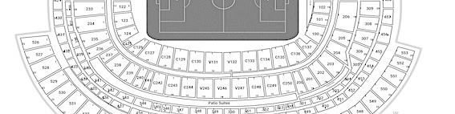
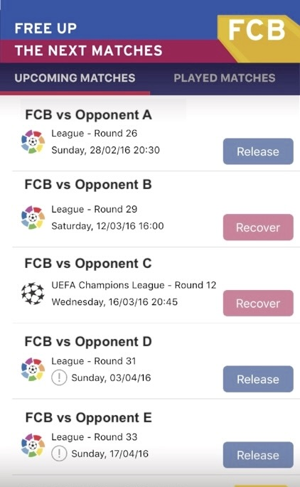
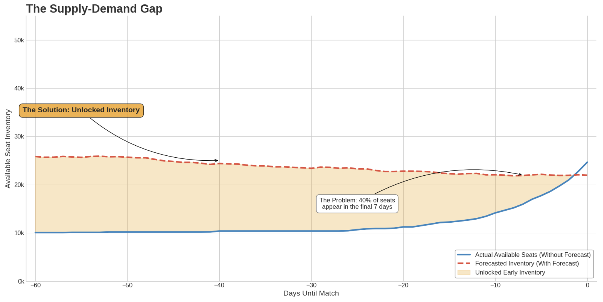
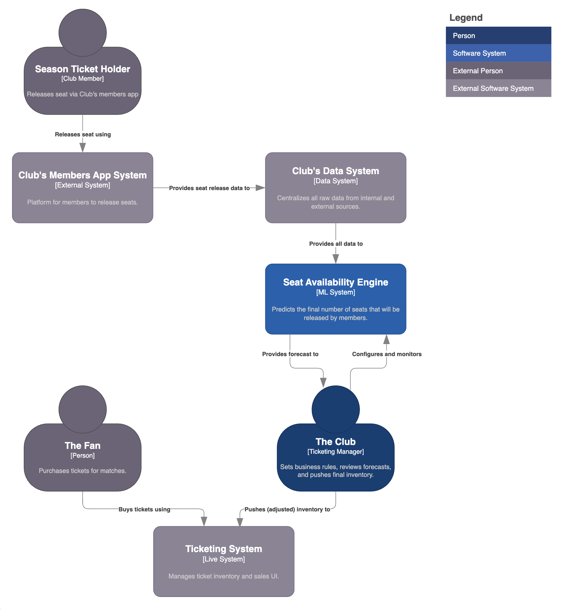

# 🏟️ Seat Availability Engine with Human-in-the-loop

<p align="left">
  
  
</p>

> An ML system that forecasts seat availability per stadium zone for football matches. **Objective:** To solve the supply-demand imbalance in ticket sales by using machine learning to predict seat availability, maximizing matchday revenue and improving the fan experience at the stadium.

### Outline

- [Key Results](#key-results)
- [Overview](#overview)
- [Architecture](#architecture)
- [Dataset](#dataset)
- [Modeling](#modeling)
- [Structure](#structure)

---

## Key Results

| Metric                      | Result                          | Description |
| :-------------------------- | :------------------------------ | :--------------------------------------------------------------------------------------------------------------------------------------- |
| 📈 Revenue Growth             | **+15%** Increase       | By forecasting future inventory, the system opened sales early to meet high fan demand, capturing revenue previously lost to "not available" messages. |
| 💰 Average Order Value      | **+20%** Increase               | Guaranteed paired and group seating, made possible by granular forecasts, encouraged larger transactions from families and groups.|
| 🎟️ Average Ticket Value     | **+10%** Increase               | Prices were set based on true forecasted supply instead of limited daily inventory, maximizing revenue per seat powered by a `dynamic pricing engine`. </br> [](https://github.com/tomas-ravalli/fcb-dynamic-pricing) |
| 🍔 In-Stadium Spend         | **+8%** Increase            | A second-order effect of higher attendance. More fans in the stadium naturally leads to increased sales of food & beverage, and merchandise.  |
| ⭐ Fan Experience           | Paired Seating Guaranteed | Transformed the fan purchase journey from a lottery to a reliable process, drastically reducing empty single seats and improving atmosphere. |
| 📢 Marketing Efficiency     | Improved ROAS **14%** | A wider time window to market the match allows for more effective campaign planning and better Return on Ad Spend.                  |
| 🛡️ Fraud Reduction          | Mitigated scalping | By delaying the dispatching of physical tickets until 48 hours before kick-off, the system combats fraud and unauthorized resale.             |
| 🎯 Forecast Accuracy        | **85%** (R²)           | The model's predictions of final seat availability were highly accurate, providing a reliable basis for advance sales.                       |


## Overview

The core business problem originates with the club's membership model. Approximately 85% of the stadium's 100,000 seats are allocated to season ticket holders (club members). This and other factors leaves only about 9,500 seats available for general sale from day one. Members who cannot attend a match can release their seat back to the Club for resale via the official `Club Members App`.

<p align="center">
  
  <br>
  <em>Fig. 1: Seat release for multiple matches from the Club's Members App.</em>
</p>

However, member behavior creates a massive supply-demand gap: **on average, 40% of members seats are released within the last 72 hours of a match**, while fan demand is already high weeks in advance. This mismatch leads to lost revenue, a poor fan experience with "not-available" messages, and fragmented single seats that are hard to sell. The diagram below illustrates the supply-demand gap the system was built to solve.

<p align="center">
  
  <br>
  <em>Fig. 2: The supply-demand gap between early fan demand and late seat releases.</em>
</p>

The **Seats Availability Engine** (AKA SmartBooking) was designed to bridge this gap. It acts as a forecasting layer, using machine learning to predict how many seats will become available per stadium zone. A **Ticketing Manager** then reviews this forecast, applies business logic and safety margins, and makes the final decision on how much inventory to push to the live ticketing system. This "human-in-the-loop" approach combines predictive power with expert oversight.

| 🚩 The Problem | 💡 The Solution |
| :--------------------------- | :---------------------------- |
| **"Not available" illusion**: Fans faced "not available" messages, unaware that thousands of seats appear in the last 72 hours. | **Advance availability**: Predicts final seat count weeks in advance, allowing the club to sell tickets for seats that are not yet officially released. |
| **Lost revenue**: High, early demand went unmet due to the delay in seat releases, leading to significant lost revenue for the club. | **Revenue capture**: Unlocks millions in sales by matching early fan demand with manager-approved predicted inventory. |
| **Poor fan experience**: The unpredictable nature of ticket availability frustrated fans and fueled secondary resale markets. | **Guaranteed experience**: Offers fans, especially families and groups, guaranteed paired seating, improving satisfaction and trust. |
| **Seat fragmentation**: Last-minute releases often resulted in many isolated single seats that were difficult to sell. | **Optimized occupancy**: By selling seats early and guaranteeing pairs, the system reduces empty singles and maximizes attendance. |


## Architecture

The general workflow is as follows:
1.  **Data Sources** are ingested, focusing on historical `Club Members App` patterns and contextual match data.
2.  The **Forecasting Engine** generates a seat availability forecast that is delivered as a recommendation to the Ticketing Manager.
3.  The **Ticketing Manager** reviews the forecast, applies a safety buffer, and pushes the final, approved inventory to the **Ticketing System**.

<p align="center">
  
    <br>
  <em>Fig. 3: [System Context Diagram] Seat Availability Engine.</em>
</p>


## Dataset

To showcase the model's capabilities, this repository uses a synthetically generated dataset engineered to mirror the complexity and statistical properties of real-world `Seient Lliure` data. The feature set is based directly on the variables used in the production model, which are grouped into logical categories to capture every angle of the problem.

By combining historical data with external factors like match importance and weather, we can build a feature set that accurately predicts a member's likelihood of releasing their seat.

<details>
<summary><b>Click to see the full list of features used in the model</b></summary>

</br>

The model uses a wide range of features, categorized to ensure a holistic view of supply and demand drivers.

| Category | Features | Description |
| :--- | :--- | :--- |
| **Match** | Day/Month/Time, Competition, Days-to-match, # Matchday | Core temporal and event-specific details. |
| **Rival** | Position, Points/Goals difference, FIFA ranking, # Trophies, Derby/Clásico | Quantifies the opponent's quality and the match's importance. |
| **Barça Momentum**| Barça Position, Last result, Goals +/-, Top player injured | Captures the team's current form and fan excitement. |
| **Sales and Stock** | Sales historical data, Free-up seats historical data, Ticket prices | Historical supply, demand, and pricing information. |
| **Members and Zones**| Max/Avg free-up per zone, Type of member, Zone, `Seient Lliure` incentives | Member-specific behavior and zone-level characteristics. |
| **Web** | Navigational data, User segmentation, Visits to checkout | Digital analytics signals indicating purchase intent. |
| **Weather** | Storm, Rain, Wind | Weather forecasts that can influence a local member's decision to attend. |
| **External Factors**| Holidays, Day before holiday, Political disturbances, New player(s) | Macro-level factors that can impact attendance. |

- **`final_released_seats`** (Integer): **(Target Variable)** The final, total number of seats that were released by season ticket holders in that zone for that match. This is the value the model aims to predict.

</details>

### Match Excitement Factor

To create a realistic dataset, the generation script doesn't just create random numbers. Instead, it simulates the underlying market dynamics by creating a unified **"Match Excitement Factor"**. This single, powerful variable acts as the primary driver for most of the demand signals in the dataset.

This systemic approach ensures that the relationships between the features in the synthetic dataset are correlated in a logical and realistic way, making it a robust foundation for building and testing a demand forecasting model.

## Modeling

The modeling approach is designed to accurately solve a single, critical business problem: predicting the final number of seats that will become available from season ticket holders. This is a classic supervised regression problem. By deconstructing the problem into its key drivers, we can build a model that reliably forecasts this supply.

This approach creates a predictive asset that the business can use to make proactive decisions, turning a forecasting model into a direct revenue-generating tool.

### 📈 Availability Forecasting

This stage answers the business question: *"For a given match, how many season ticket seats will ultimately be returned to the club?"*

| Aspect | Description |
| :--- | :--- |
| **Model** | An **`XGBoost` Regressor**. |
| **Rationale** | After exploring several algorithms (including Decision Trees and Neural Networks), XGBoost was chosen for its high performance, speed, and its ability to handle complex, non-linear relationships. It effectively models how factors like opponent strength, day of the week, and team performance interact to influence a member's decision to release their seat. |
| **Features** | The model uses a rich set of features including match context (`opponent_tier`), temporal factors (`days_until_match`), team performance (`team_position`), and external factors (`holidays`) to build a comprehensive view of the drivers behind seat availability. |
| **Application** | The model's forecast is delivered as a **recommendation** to the Ticketing Manager. A safety buffer (e.g., 95% of the forecast) is manually applied by the manager to mitigate risk before the final inventory is pushed live. |
| **Design Choice** | While time-series models could model release patterns over time, a gradient boosting model like `XGBoost` is better suited to predict a single, final outcome (total released seats) based on a wide array of static features for a given match. It excels at capturing the combined impact of all variables at once. |

<details>
<summary><b>Click to see the detailed model performance evaluation</b></summary>
</br>

The success of the SmartBooking system hinges on the accuracy of its core forecast. The model was evaluated against simpler benchmarks to prove its value.

| Source of Prediction | Accuracy |
| :--- | :--- |
| Averages (Mean, Median, etc.) | 45% |
| Domain Experts | 65% |
| **Machine Learning Model** | **85%** (R²) |

*Table: Comparison of prediction accuracy across different methods.*

The model's **85% accuracy** was deemed highly successful, providing a strong statistical foundation for the business to act on the forecasts with confidence. The model was also interpreted using **SHAP values** to ensure the relationships it learned were logical and explainable to stakeholders.

</details>

### Validation

Validating the model's business impact required moving beyond simple accuracy metrics to rigorously measure its causal effect on revenue. The core question was: "**Does using this model's forecast cause an increase in revenue?**"

To answer this, we implemented a two-fold validation framework. This approach confirmed a **+15% increase in total ticket sales revenue**, directly attributable to the SmartBooking system.

<details>
<summary><b>Click to see the full validation framework</b></summary>

#### 1. Deconstruct the System: The Validation Strategy

The first step was to frame the problem correctly. A simple A/B test comparing different matches is invalid due to confounding variables (opponent quality, weather, etc.). Our strategy therefore combined offline and online validation.

* **Offline Validation (Pre-Flight Check):** Before any real-world testing, we performed rigorous backtesting on historical data. This involved training the model on a period of data and evaluating its forecast accuracy on a hold-out set. We used SHAP values to interpret the model's predictions, ensuring it learned logical patterns and wasn't relying on spurious correlations. This validated the model's fundamental soundness.

* **Online Validation (Causal Impact Measurement):** To measure the real-world impact, we implemented a quasi-experimental design using **Propensity Score Matching (PSM)**. This statistical technique allowed us to create a fair, "apples-to-apples" comparison group from historical data, effectively simulating a controlled experiment to isolate the model's causal effect on revenue.

#### 2. Quantify the Components: The Execution Plan

This phase involved executing the PSM design to get a reliable measurement of the financial lift.

* **Define Groups**: We established two groups for our analysis:
    * **Treatment Group**: A set of recent matches where the Ticketing Manager used the SmartBooking forecast to release inventory.
    * **Control Group**: A large pool of historical matches from seasons where the SmartBooking system did not exist.

* **Build the Propensity Model**: We built a supervised classification model to calculate a "propensity score" for every match in both groups. This score quantifies the character of each match based on its features (opponent tier, competition, day of the week, etc.), representing the probability of it receiving the "treatment."

* **Match & Compare**: Using a nearest-neighbor matching algorithm, we found a "statistical twin" from the control group for each match in the treatment group. This twin was the historical match with the most similar propensity score, ensuring the comparison was fair.

* **Define KPIs**: We measured the difference between the matched pairs across several metrics:
    * **Primary KPI**: Total Ticket Revenue.
    * **Secondary KPIs**: Final Attendance Rate, Average Order Value (AOV), and the sell-through rate of the predicted inventory.

This rigorous process gave us high confidence that the measured uplift was due to the SmartBooking system and not external factors.

</details>


## Structure

While most of the source code for this project is private, this section outlines the full structure:

```bash
FCB_Smart-Booking/
├── .gitignore                              # (Public) Specifies files for Git to ignore.
├── LICENSE                                 # (Public) Project license.
├── README.md                               # (Public) This project overview.
├── requirements.txt                        # (Private) The requirements file for the full project.
├── config.py                               # (Private) Configuration file for paths and parameters.
├── assets/                                 # (Public) Diagrams and images for documentation.
├── data/
│   └── 03_synthetic/
│       └── synthetic_match_data.csv        # (Public) The generated synthetic dataset.
├── models/                                 # (Private) Stores trained model artifacts.
│   └── availability_forecast_model.joblib
├── notebooks/                              # (Private) Jupyter notebooks for analysis.
│   └── eda.ipynb
└── src/
    ├── __init__.py                         # (Private) Makes src a Python package.
    ├── data/
    │   └── make_dataset.py                 # (Public) The script to generate the synthetic data.
    ├── features/                           # (Private) Scripts for feature engineering.
    │   └── build_features.py
    └── models/                             # (Private) Scripts for model training and prediction.
        ├── train_availability_model.py
        └── predict_availability.py
```

</br>

> [!WARNING]
> * **Data:** All data presented in this public repository is synthetically generated. It is designed to mirror the statistical properties of the original dataset without revealing any confidential information.
> * **Code:** To honor confidentiality agreements, the source code and data for the original project are private. This repository demonstrates the modeling approach and best practices used in the real-world solution.
> * **Complexity:** This repository provides a high-level demonstration of the project's architecture and methodology. Certain implementation details and model complexities have been simplified for clarity.

</br>

<p align="center">🌐 © 2025 t.r.</p>
