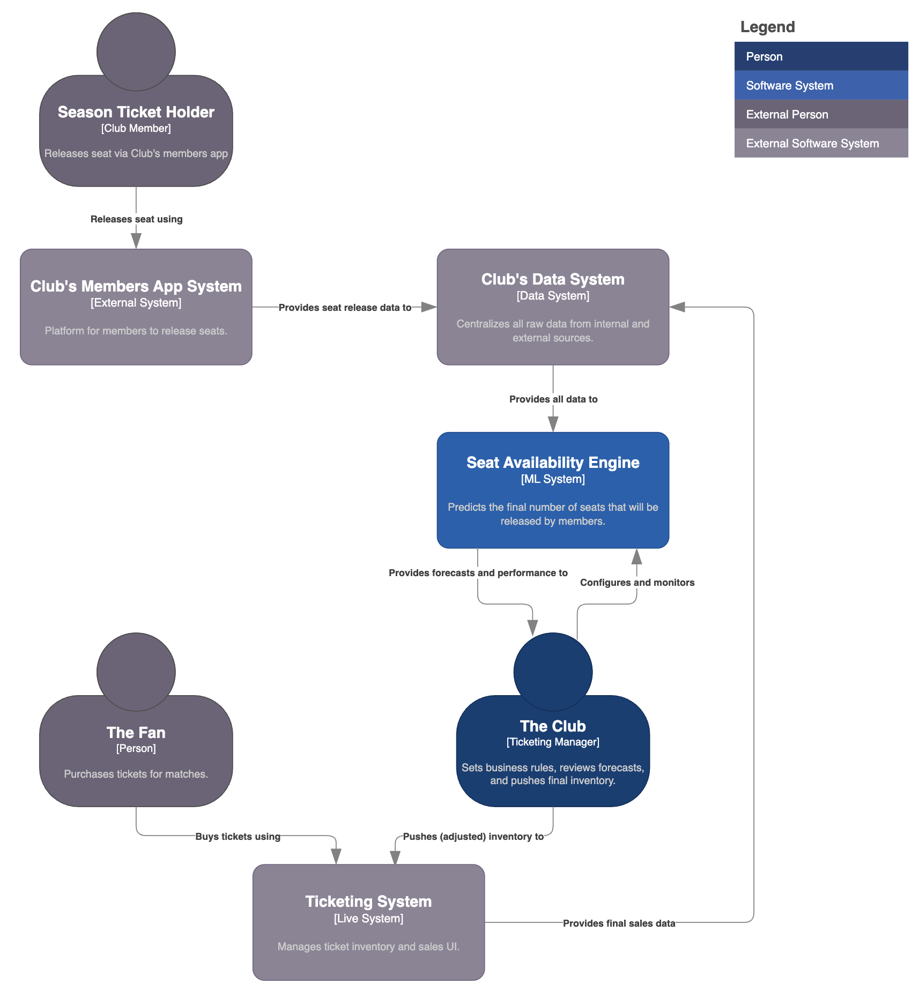
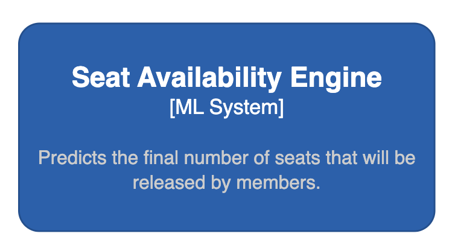

# Seat Availability Engine with Human-in-the-loop

<p align="left">
 
</p>

An ML system that forecasts seat availability for each stadium zone per match across multiple time horizons. **Objective:** To solve the supply-demand imbalance in ticket sales by using machine learning to predict seat availability, maximizing revenue and improving the fan experience at the stadium.

### Outline

- [Key Results](#key-results)
- [Overview](#overview)
- [Architecture](#architecture)
- [Dataset](#dataset)
- [Modeling](#modeling)
- [Usage](#usage)
- [Structure](#structure)

---

## Key Results

| Metric                      | Result                          | Description |
| :-------------------------- | :------------------------------ | :--------------------------------------------------------------------------------------------------------------------------------------- |
| 📈 Revenue Growth             | **+15%** Increase       | By forecasting future inventory, the system opened sales early to meet fan demand, capturing revenue previously lost to "not available" messages. |
| 💰 Average Order Value      | **+20%** Increase               | Guaranteed paired and group seating, made possible by granular forecasts, encouraged larger transactions from families and groups.|
| 🎟️ Average Ticket Value     | **+10%** Increase               | Prices were set based on true forecasted supply instead of limited daily inventory, maximizing revenue per seat powered by a `dynamic pricing engine` [](https://github.com/tomas-ravalli/dynamic-pricing-engine) |
| 🍔 In-Stadium Spend         | **+8%** Increase            | A second-order effect of higher attendance. More fans in the stadium naturally leads to increased sales of food & beverage, and merchandise.  |
| ⭐ Fan Experience           | Paired Seating Guaranteed | Transformed the fan purchase journey from a lottery to a reliable process, drastically reducing empty single seats and improving atmosphere. |
| 🎯 Forecast Accuracy        | **84%** (R²)           | The model's predictions of final seat availability were highly accurate, providing a reliable basis for advance sales.                       |


## Overview

The core business problem originates with the club's membership model. Approximately 85% of the stadium's 100,000 seats are owned by season ticket holders (club members). This and other factors leaves only about 10% of stadium seats available for general sale from day one. Members who won't attend a match can release their seat back to the Club for resale via the official `Club Members App`.

<p align="center">
  
  <br>
  <em>Fig. 1: Seat release for multiple matches from the Club's Members App.</em>
</p>

However, member behavior creates a massive supply-demand gap: **on average, 40% of members seats are released within the last 72 hours of a match**, while fan demand is already high months in advance. This mismatch leads to lost revenue, a poor fan experience with "not-available" messages, and fragmented single seats that are hard to sell. The diagram below illustrates the supply-demand gap the system was built to solve.

<p align="center">
  
  <br>
  <em>Fig. 2: The supply-demand gap between early fan demand and late seat releases.</em>
</p>

The **Seats Availability Engine** (AKA SmartBooking) was designed to bridge this gap. It acts as a forecasting layer, using machine learning to predict how many seats will become available per stadium zone at various time horizons before match day. A **Ticketing Manager** then reviews this forecast, applies business logic and safety margins, and makes the final decision on how much inventory to push to the live ticketing system. This human-in-the-loop approach combines predictive power with expert oversight.

| 🚩 The Problem | 💡 The Solution |
| :--------------------------- | :---------------------------- |
| **"Not available" illusion**: Fans faced "not available" messages, unaware that new seats appear in the last 72 hours. | **Advance availability**: Predicts final seat count weeks in advance, allowing the club to sell tickets for seats that are not yet officially released. |
| **Lost revenue**: High, early demand went unmet due to the delay in seat releases, leading to significant lost revenue for the club. | **Revenue capture**: Unlocks millions in sales by matching early fan demand with manager-approved predicted inventory. |
| **Poor fan experience**: The unpredictable nature of ticket availability frustrated fans and fueled secondary resale markets. | **Guaranteed experience**: Offers fans, especially families and groups, guaranteed paired seating, improving satisfaction and trust. |
| **Seat fragmentation**: Last-minute releases often resulted in many isolated single seats that were difficult to sell. | **Optimized occupancy**: By selling seats early and guaranteeing pairs, the system reduces empty singles and maximizes attendance. |


## Architecture

<p align="center">
  
    <br>
  <em>Fig. 3: [System Context Diagram] Seat Availability Engine.</em>
</p>

### System synergy
The forecast generated by the Seat Availability Engine is a critical input for the club's **[Dynamic Pricing Engine](https://github.com/tomas-ravalli/dynamic-pricing-engine)**. Knowing the true expected supply allows the pricing engine to move beyond simple static pricing and set optimal prices that accurately reflect real-time market conditions. This synergy between forecasting supply and optimizing price is what unlocks significant revenue growth.


## Dataset

The model is trained on a time-series dataset structured to allow for dynamic predictions at any point before a match. The granularity is a **daily snapshot** for each match and stadium zone. For each day, the data includes time-dependent features like `seats_released_so_far` and joins them with static contextual features like opponent and weather. The **target variable**, `final_released_seats`, is the total number of seats that will ultimately be released for that match-zone.

### Features

The model uses a wide range of features, categorized to ensure a holistic view of supply and demand drivers.

| Category          | Features                                                                                 | Description                                                      |
| :---------------- | :--------------------------------------------------------------------------------------- | :--------------------------------------------------------------- |
| **Match** | `weekday`, `month`, `kick-off_time`, `competition`, `is_weekend`                           | Core temporal and event-specific details for the match.          |
| **Opponent** | `opponent_position`, `is_derby`                                                          | Quantifies the opponent's quality and the match's rivalry level. |
| **Team Momentum** | `team_position`, `last_match_lost`, `goal_difference_last_5`, `top_player_injured`       | Captures the home team's recent performance and status.          |
| **Weather** | `is_rain`, `is_storm`, `is_wind`                                                         | Forecasted weather conditions that can influence attendance.     |
| **External** | `is_holiday`, `day_before_holiday`, `new_player_debuting`, `popular_concert_in_city` | External events and factors that can impact attendance decisions.|
> **`final_released_seats`**[Target Variable]: The final, total number of seats that were released by season ticket holders in that zone for that match. This is the value the model aims to predict.

## Modeling

The modeling approach is designed to provide dynamic forecasts that update over time. Instead of a single prediction, the system can answer the business question: *"Given everything we know **today**, how many seats will ultimately be released by club members?"*

<p align="left">
  
  <br>
  <em>Fig. 4: Seats Availability Engine component.</em>
</p>

### Supply Forecasting

This approach creates a predictive asset that the business can use to make proactive decisions.

| Aspect | Description |
| :--- | :--- |
| **Model** | **`XGBoost`** |
| **Rationale** | XGBoost excels at handling the mix of static and dynamic features in the time-series dataset. It can effectively model how the forecast should evolve as new information (like daily seat releases) becomes available closer to the match day. |
| **Application** | The model can generate a new forecast in **7 timeframes** (1/3/7/14/30/90). This allows the Ticketing Manager to monitor how the prediction evolves as new data becomes available and apply a safety buffer to the latest forecast, enabling more agile inventory management. |
| **Production Trade-offs** | The chosen model provides the best balance between **prediction accuracy**, **serving speed** (latency), and **inference cost**, ensuring strong performance in a live environment. |

<details>
<summary><b>Click to see the detailed model performance evaluation</b></summary>
</br>

The model was evaluated against simpler benchmarks to prove its value, as there was no intelligent system in place before to compare against:

| Source of Prediction | Accuracy |
| :--- | :--- |
| Averages (Mean, Median, etc.) | 45% |
| Domain Experts | 65% |
| **Machine Learning Model** | **84%** (R²) |

The model's **84% accuracy** provided a strong statistical foundation for the business to act on the forecasts with confidence. The model was also interpreted using **SHAP values** to ensure the relationships it learned were logical and explainable to stakeholders.

</details>

### Validation

Validating the model's business impact required moving beyond simple accuracy metrics to rigorously measure its causal effect on revenue. The core question was: "*Does using this model's forecast cause an increase in revenue?*"

To answer this, we implemented a two-fold validation framework. This approach confirmed a **+15% increase in total ticket sales revenue**, directly attributable to the Seat Availability ML system.

<details>
<summary><b>Click to see the full validation framework</b></summary>

#### 1. Strategy

The first step was to frame the problem correctly. A simple A/B test comparing different matches is invalid due to confounding variables (opponent quality, weather, etc.). Our strategy therefore combined offline and online validation.

* **Offline validation:** Before any real-world testing, we performed rigorous backtesting on historical data. This involved training the model on a period of data and evaluating its forecast accuracy on a hold-out set. We used SHAP values to interpret the model's predictions, ensuring it learned logical patterns and wasn't relying on spurious correlations. This validated the model's fundamental soundness.

* **Online validation:** To measure the real-world impact, we implemented a quasi-experimental design using **Propensity Score Matching (PSM)**. This statistical technique allowed us to create a fair, "apples-to-apples" comparison group from historical data, effectively simulating a controlled experiment to isolate the model's causal effect on revenue.

#### 2. Execution

This phase involved executing the PSM design to get a reliable measurement of the revenue lift.

* i. **Define groups**: We established two groups for our analysis:
    * **Treatment group**: A set of recent matches where the Ticketing Manager used the ML system forecast to release inventory.
    * **Control group**: A large pool of historical matches from seasons where the ML system did not exist.

* ii. **Build the propensity model**: We built a supervised classification model to calculate a "propensity score" for every match in both groups. This score quantifies the character of each match based on its features (opponent tier, competition, day of the week, etc.), representing the probability of it receiving the "treatment."

* iii. **Match & compare**: Using a nearest-neighbor matching algorithm, we found a "statistical twin" from the control group for each match in the treatment group. This twin was the historical match with the most similar propensity score, ensuring the comparison was fair.

* iv. **Define KPIs**: We measured the difference between the matched pairs across several metrics:
    * **Primary KPI**: Total Ticket Revenue.
    * **Secondary KPIs**: Final Attendance Rate, Average Order Value (AOV), and the sell-through rate of the predicted inventory.

This rigorous process gave us high confidence that the measured uplift was due to the ML system and not external or random factors.

</details>

## Usage

The Seats Availability Engine operates on a **human-in-the-loop** model, empowering the Ticketing Manager with data-driven forecasts to make strategic decisions. The system does not automatically push inventory to the market; instead, it provides a reliable forecast that allows for proactive and controlled inventory management. 

1.  **Forecast generation**: The **Seat Availability Engine** predicts the final number of released seats for an upcoming match, providing a forecast for each stadium zone at various time horizons.
2.  **Human review & risk management**: The **Ticketing Manager** reviews these evolving forecasts via a dashboard. Based on the model's prediction and their own business expertise, they decide when to apply a **risk buffer** (a safety margin) and how many seats to release to the market.
3.  **Strategic inventory release**: The manager strategically manages this predicted inventory, pushing a portion of the forecast to the live ticketing system to meet fan demand. This aligns supply with the market dynamics, unlocking revenue that was previously lost.
4.  **Fan purchase**: Fans can now purchase tickets for popular matches far in advance, improving their experience and allowing the club to capture revenue earlier and to effectively apply a dynamic pricing strategy.


## Structure

While most of the source code for this project is private, this section outlines the full structure. You can explore the synthetic data generation logic in `src/data/` to see how the realistic environment was simulated.

```
fcb-smartbooking/
├── .gitignore                            # (Public) Specifies files for Git to ignore.
├── LICENSE                               # (Public) Project license.
├── README.md                             # (Public) This project overview.
├── requirements.txt                      # (Private) The requirements file for the full project.
├── config.py                             # (Private) Configuration file for paths and parameters.
├── assets/                               # (Public) Diagrams and images for documentation.
├── data/
│   ├── club_members_app.csv              # (Private) Synthetic raw seat release events.
│   └── match_data_timeseries.csv         # (Private) The final time-series modeling dataset.
├── notebooks/
│   └── eda.ipynb                         # (Private) Exploratory Data Analysis.
└── src/
    ├── __init__.py
    ├── features/
    │   └── build_features.py             # (Private) Feature engineering scripts.
    └── models/
        ├── train_availability_model.py   # (Private) Script for model training.
        └── predict_availability.py       # (Private) Script for generating predictions.
```

</br>

> [!WARNING]
This repository provides a high-level demonstration of the project's architecture and methodology. Certain implementation details and model complexities have been simplified for clarity.

</br>

<p align="center">🌐 © 2025 t.r.</p>
